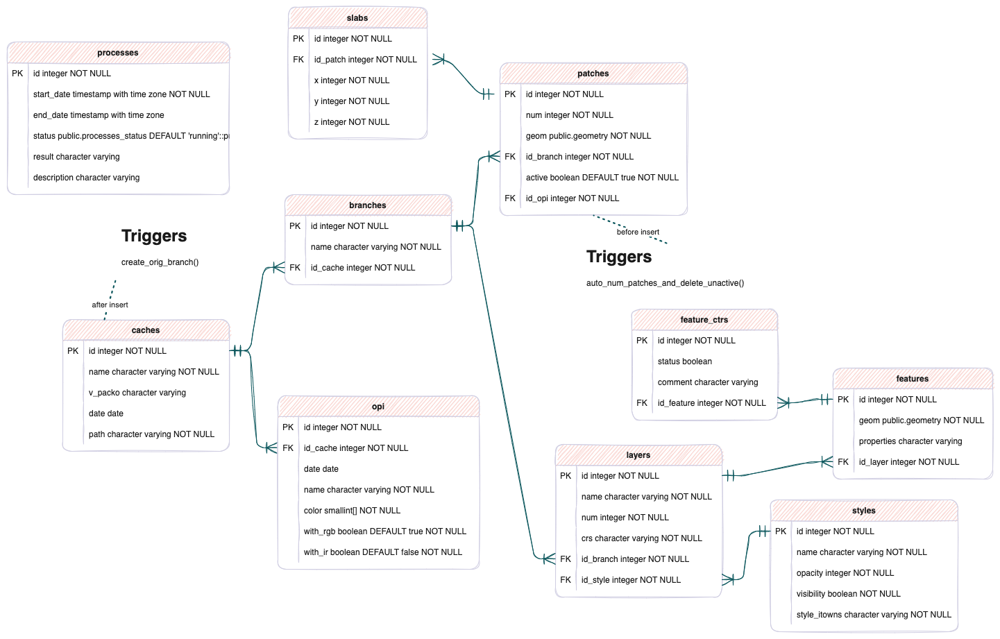

# PackO

Outil pour le contrôle et la retouche du mosaïquage, sous licence CECILL-B (voir [LICENSE.md](LICENSE.md)).

4 modules :
- une BD Postgis
- une API
- un client web
- un code python pour la création et mise à jour du cache

## BD

Une base de données est utilisée pour stocker les métadonnées des caches (liste des OPI avec leur date, nom, couleur, ...) ainsi que l'historique sur chaque branche (liste des patches).

La structure de cette base:


Il est nécessaire d'avoir un PostGIS version 3.0 au minimum. 

La base de donnée doit être créée avant le lancement de l'API:
```
psql -c "CREATE DATABASE packo"
psql -d packo -f sql/packo.sql
```

## API

### Pour installer et lancer le service

La commande classique avec NodeJs:
```shell
npm install
```

Préparer le client web:
- en mode production
```shell
npm run build
```
- en mode développement (avec le menu "clear")
```shell
npm run build-dev
``` 

Ensuite on peut lancer l'API, la doc et l'interface web en spécifiant un port (par défaut le service sera lancé sur le port 8081). Il est possible de le lancer en mode **simple** avec une seule instance ou en mode **cluster** avec plusieurs instances pour exploiter plusieurs coeurs sur le serveur.

Le mode **simple**:

- en mode production
```shell
npm start -- -p [port]
```
- en mode développement (qui autorise la route "clear")
```shell
npm run start-dev -- -p [port]
```

Le mode **cluster**:

Dans ce mode, on utilise le module **[PM2](https://pm2.keymetrics.io/)** pour piloter le lancement de plusieurs instances de l'API et la répartition du traitement des requêtes entre ces différentes instances. Cela permet donc d'avoir un serveur plus réactif et rapide, même lorsqu'il y a des requêtes longues et/ou plusieurs utilisateurs.

Dans ce cas, on décrit la configuration (nombre de coeurs, variable d'environement, etc...) dans un fichier **ecosystem.config.js**. Un exemple de fichier de configuration est inclus dans le dossier **ressources**  du projet. Si on le copie à la racine, il permet de lancer un cluster nommé **packo** qui exploite par défaut tous les coeurs de la machine.

Comme dans le cas d'un **npm run start** l'application utilisera les variables d'environnement du système pour connaitre l'adresse du serveur PostGis, l'utilisateur, le mot de passe et le nom de la base (PGHOST, PGUSER, PGPASSWORD, PGDATABASE).

Pour définir le port utilisé par l'API, il faut éditer le paramètre **args** dans le fichier **ecosystem.config.js**: dans l'exemple qui est fourni dans le dossier **ressources** on utilise le port 8081:

````
module.exports = {
  apps: [{
    name: 'packo',
    script: 'serveur.js',
    args: '-p 8081',
    instances: 'max',
    exec_mode: 'cluster',
    env: {
      NODE_ENV: 'production',
    },
    env_development: {
      NODE_ENV: 'development',
    }
  }],
};
````


Pour choisir si on travaille en mode **production** ou en mode **development** (qui autorise la route **clear**), on peut spécifier l'environement à utiliser dans le ligne de commande.

Par exemple, on peut:

- lancer les instances de l'API en mode **production** (le mode par défaut) avec la commande:
```
npx pm2 start
````

- lancer les instances de l'API en mode **development** avec la commande:
```
npx pm2 start --env development
````

- suivre l'état et l'utilisation de ces instances avec la commande:
```
npx pm2 monit
````

- arrêter toutes les instances avec la commande:
```
npx pm2 delete packo
```

Dans les deux cas (mode **simpe** ou **multi coeurs**), l'interface web est alors accesible à l'adresse :  http://[serveur]:[port]/itowns/?serverapi=[serveur]&portapi=[port]&namecache=[namecache]

par défaut:

- serveur: localhost
- port: 8081
- serverapi: la même valeur que le serveur
- portapi: la même valeur que le port
- namecache: pas de valeur par défaut, mais si le paramètre n'est pas renseigné ou si il est mal renseigné, choisir un cache dans la liste des caches disponibles

La doc de l'API est publiée directement par le service et est disponible à l'adresse : http://[serveur]:[port]/doc

Attention, l'API utilise une version de GDAL pour la lecture et la création des images du cache. Si une version de GDAL est déjà présente sur la machine, il peut y avoir des problèmes avec la variable d'environnement **PROJ_LIB** qui indique l'emplacement du dossier qui contient la définition des systèmes de coordonnées. Dans ce cas, l'API va signaler une erreur lors de l'application d'une retouche (erreur visible dans la console côté serveur et dans l'interface iTowns côté client). Si cela se produit, il faut supprimer la variable d'environnement **PROJ_LIB** avant de lancer l'API.
Sous MacOS ou Linux, cela peut être fait avec la commande:
```
unset PROJ_LIB
```
Sous Windows:
```
SET PROJ_LIB=
```


### Principe de fonctionnement

Ce service propose: 

- un flux WMTS standard pour les couches ortho et graph
- un flux WMTS permettant d'accéder aux OPI: ce flux est déclaré comme une couche unique (opi) et on utilise un paramètre de dimension pour choisir le cliché à afficher.
- une commande permettant de modifier le graphe en donnant: un geojson + une référence de cliché

Pour le flux WMTS de l'Ortho et des OPI, il est possible de choisir entre RVB, IR ou IRC en spécifiant le style (normal ou RVB pour avoir la couleur, IR pour l'infrarouge seul et IRC pour l'infrarouge coloré). Attention, lorsque le flux demandé n'est pas disponible (par exemple l'IR), la réponse est une image noire.

## Client web (uniquement si on souhaite le lancer séparément)

### Installation et lancement

dans le dossier ./itowns
```shell
npm install
```

En phase de développement on lance le service avec :

```shell
npm start
```
qui permettra un redémarrage du serveur automatique à chaque modification de fichier

En production il faut exécuter :
```shell
npm run build
```

### Principe de fonctionnement

Fournir à travers un navigateur web :
- une consultation des données ortho
- des outils de retouche du graphe de mosaiquage

## Préparation d'un cache

Un cache PackO se crée à partir d'un graphe de mosaiquage initial (sous forme d'un GeoPackage ou d'une BD) ainsi qu'un dossier contenant les OPI dans un format supporté par GDAL avec leur géoréférencement.

Pour les gros caches, il est préférable de créer une BD à partir du fichier Shapefile, cela peut être fait avec la commande **shp2pgsql**. Il est important de vérifier que le code de projection a bien été renseigné dans le base. Par exemple:
```bash
createdb bd_graphe
psql -d bd_graphe -c 'create extension postgis'
shp2pgsql graphe.shp | psql -d bd_graphe
psql -d bd_graphe -c "SELECT UpdateGeometrySRID('graphe','geom',2154)"
```

PackO peut gérer des images 3 canaux (RGB), 4 canaux (RGB + IR) ou mono canal (IR). Attention: toutes les OPI du cache doivent avoir le même type (RGB, IR ou RGB+IR).

La création du cache est faite à l'aide du script **create_cache.py**:
````
usage: create_cache.py [-h] [-R RGB] [-I IR] [-c CACHE] [-o OVERVIEWS] [-g GEOPACKAGE] [-t TABLE] [-p PROCESSORS] [-v VERBOSE]

optional arguments:
  -h, --help            show this help message and exit
  -R RGB, --rgb RGB     input RGB OPI pattern
  -I IR, --ir IR        input IR OPI pattern
  -c CACHE, --cache CACHE
                        cache directory (default: cache)
  -o OVERVIEWS, --overviews OVERVIEWS
                        params for the mosaic (default: ressources/LAMB93_5cm.json)
  -g GEOPACKAGE, --geopackage GEOPACKAGE
                        in case the graph base is a GeoPackage and not a postgres base define through env variables
  -t TABLE, --table TABLE
                        graph table (default: graphe_pcrs56_zone_test)
  -p PROCESSORS, --processors PROCESSORS
                        number of processing units to allocate (default: Max_cpu-1)
  -v VERBOSE, --verbose VERBOSE
                        verbose (default: 0)
````


Ce script nécessite deux modules: numpy et gdal (version au moins 3.2). Par exemple, sous Linux, on peut les installer avec les commandes:
````
python -m pip install --upgrade pip
pip install numpy
pip install --global-option=build_ext --global-option="-I/usr/include/gdal" GDAL==`gdal-config --version`
````

Par exemple, pour créer un cache à partir des données incluses dans le dossier **regress**, on peut utiliser la commande suivante depuis la racine du dépôt PackO:
````
python scripts/create_cache.py -i "regress/data/*.tif" -o ressources/LAMB93_5cm.json -c cache_regress -g "regress/data/regress_graphe.gpkg" -t graphe
````

Ce script fonctionne en deux phases:

- on découpe les OPI en dalles respectant une pyramide TMS que l'on stocke sous forme de COG
- on rasterise le graphe de mosaiquage et on exporte pour chaque dalle un COG de graphe (image de graphe avec une couleur par OPI) et un COG de l'ortho assemblée

Le script permet d'obtenir trois arborescences de COG (graph/opi/ortho) et un fichier overviews.json qui décrit la liste des dalles et la liste des OPI avec les métadonnées associées. 

Une fois le cache créé, on peut y ajouter des OPI si nécessaire avec le script **update_cache.py**:

````
usage: update_cache.py [-h] [-R RGB] [-I IR] [-c CACHE] [-r REPROCESSING] [-g GEOPACKAGE] [-t TABLE] [-p PROCESSORS] [-v VERBOSE]

optional arguments:
  -h, --help            show this help message and exit
  -R RGB, --rgb RGB     input RGB OPI pattern
  -I IR, --ir IR        input IR OPI pattern
  -c CACHE, --cache CACHE
                        cache directory (default: cache)
  -r REPROCESSING, --reprocessing REPROCESSING
                        reprocessing of OPI already processed (default: 0, existing OPIs are not reprocessed)
  -g GEOPACKAGE, --geopackage GEOPACKAGE
                        in case the graph base is a GeoPackage and not a postgres base define through env variables
  -t TABLE, --table TABLE
                        graph table (default: graphe_pcrs56_zone_test)
  -p PROCESSORS, --processors PROCESSORS
                        number of processing units to allocate (default: Max_cpu-1)
  -v VERBOSE, --verbose VERBOSE
                        verbose (default: 0)
````
Attention, les OPI qui sont ajoutées doivent avoir le même type que celles déjà présentes dans le cache (RGB, IR ou RGB+IR).

Par exemple, sur les données du dossier **regress**, on peut ajouter l'OPI isolée du dossier **regress/update** dans le cache créé précédemment:
````
python scripts/update_cache.py -i "regress/data/update/*.tif" -c cache_regress -g "regress/data/regress_graphe.gpkg" -t graphe
````

Pour importer un cache dans la BD packo, il faut utiliser la route POST **cache** de l'API: http://[serveur]:[port]/doc/#/cache/post_cache.

Cette route prend en paramètre:

- le nom du cache (il doit être unique dans la base)
- le chemin du dossier contenant les COG créé par le script **create_cache** et correspondant au cache à importer (ex: "cache_test"): soit en absolu, soit en relatif par rapport au dossier de lancement de l'API
- le contenu du fichier **overviews.json** du cache à importer (celui qui a été créé par le script python et qui est à la racine du dossier contenant le cache à importer)

## Traitement d'un chantier

### Connection à un cache

A partir du client web en ajoutant le paramètre namecache={nom du cache en base} (ex : "cache_test"), on peut visualiser le cache choisi et commencer à travailler dessus.

### Import de couches vecteur annexes

A partir de l'interface web, on peut intégrer des couches vecteur (au format geojson ou shapefile) en les glissant directement dans la vue. 
Pour les fichiers shapefile, il faut glisser les fichiers .shp, .shx, .dbf et .prj en même temps.
Pour des soucis d'intégrité, si on désire ajouter plusieurs couches, il faut les ajouter une à une.
Chaque couche ajoutée est sauvegardée dans la base de données.

Actuellement les couches de polygone multipart ne sont pas bien gérées, il faut exploser ces couches en polygone simple avant de les ajouter à la vue itowns.

Les paramètres d'affichage des couches ne sont pas persistants après un changement de branche de saisie ou de rafraîchissement de la page dans le navigateur.

### Gestion des couches d'alertes

Pour naviguer à travers les entités d'une couche annexe prélablement ajoutée, il faut choisir cette couche dans le menu déroulant "Alerts Layer".
A partir du moment où une couche a été selectionnée, la vue est centré sur la première entité non encore passée en revue et les champs "Alert id", "Progress", "Validated" ainsi que le bouton "Mark as Unchecked" apparaisent avec leurs valeurs mises à jour.
On peut ensuite naviguer à travers les différentes entités :
- en utilisant les flèches droite et gauche (ou haut et bas),
- en cliquant directement sur l'entité voulue,
- en entrant l'id de l'entité voulue dans le champ "Alert id".

Les champs "Alert id", "Progress", "Validated" (et "Remark" pour la couche 'Remarques') sont rafraichis avec les valeurs de l'entité selectionnée.

Les flèches haut et bas proposent le même principe que droite et gauche avec pour seule différence de ne naviguer qu'à travers les entités non-vues.

Une entité peut se retrouver sous 3 statuts différents : *non-vu*, *vu* et *validé*. Par défaut le statut de chaque entité est *non-vu*. Dés que celle ci se retrouve selectionnée (par une des 3 methodes citées ci dessus) son statut passe à *vu*. Le bouton "Validated" permet de changer le statut de l'entité à *validé* et le bouton "Mark as unchecked" permet de revenir au statut *non-vu* (ne marche pas si l'entité à déja été validée).


### Couche d'annotation (Remarques)

Sur chaque branche, une couche vecteur 'Remarques' est par défault créée qui peut être traitée comme une couche d'alerte.
Le bouton "Add remark" permet à tout moment d'ajouter une entité ponctuelle sur la couche 'Remarques", en cliquant sur la vue et de renseigner un texte.
Lorsque la couche de 'Remarques' est choisie comme couche d'alerte, en plus des fonctionnalités propres aux couches d'alerte (voir paragraphe précedent), le champ "Remark" est affiché (contenant le texte entré lors de la création de l'entité) et on peut aussi détruire l'entité selectionnée avec le bouton "Delete Remark".

A tout moment, cette couche "Remarques" peut être exportée en geoJson en appelant la route GET /{idBranch}/vector?name=Remarques. (En utilisant le swagger par exemple.)

### Retouches

Les étapes du processus de retouche du graphe de mosaïquage sont :
* choisir la branche de saisie dans le menu déroulant "Active branch" (utiliser "Add new branch" pour créer une nouvelle branche)
* choisir l'OPI de travail avec "Select an OPI"
* démarrer la retouche ("Start polygon"), appuyer sur la touche "Majuscule" du clavier pour fermer la saisie
* annuler ou refaire la retouche en utilisant les outils "undo", "redo"

Les contours des retouches d'un chantier peuvent être affichés en activant l'option "visible" de la couche "Patches".

## Travailler à plusieurs sur un chantier

Il ne faut jamais travailler à plusieurs en même temps sur la même branche. Pour l'instant aucune vérification n'est faite au niveau de PackO et cela va conduire à des incohérences (un mécanisme de protection sera ajouté dès que possible).

Pour travailler à plusieurs sur un chantier: chaque personne doit créer une branche et travailler uniquement dans cette branche.

Lorsque le travail est terminé, on peut rassembler les branches pour obtenir le résultat complet. Le principe, se base sur la notion de **rebase** de **git**: on choisit une branche (**B1**) et on demande à faire un **rebase** sur une autre branche (**B2**) en lui donnant un nouveau nom.

En pratique, PackO va effectuer les opérations suivantes:

- création de la nouvelle branche avec le nom choisi
- copie des patchs de **B2** dans cette nouvelle branche: c'est rapide puisque l'historique et les résultats d'application de patch sont simplement copiés
- une fois que cette copie est prête: l'utilisateur reçoit une réponse avec l'Id de la nouvelle branche et l'Id du processus long pour suivre l'avancement du **rebase**
- PackO va ensuite appliquer tous les patchs de **B1** sur cette nouvelle branche. Cela va prendre du temps puisqu'il faut rejouer chaque patch un par un dans l'ordre.
- Lorsque les traitements sont terminés, le processus est mis à jour avec la date de fin et son statut est passé à **succeed**

Il n'y a pas d'interface pour faire le **rebase** depuis iTowns, il faut utiliser la doc: 
````
http://[serveur]:[port]/doc/#/branch/post__idBranch__rebase 
````
pour lancer la commande et 
`````
http://[serveur]:[port]/doc/#/process/get_process__id_
`````
pour suivre l'avancement du traitement.

Attention: si les deux branches ont modifié les mêmes zones de l'ortho le résultat peut-être imprévisible puisqu'on applique d'abord les patchs de la branche de base (**B2**), puis ceux de la branche **B1**. Un mécanisme d'alerte sera ajouté dès que possible pour signaler ces cas et permettre à un opérateur de les controler efficacement. En attendant, il est recommandé de définir la zone à traiter pour chaque opérateur et de gérer les cas limites globalement en fin de chantier. 

## Export raster

Une fois les contrôles et retouches effectués, il est possible d'exporter l'ortho résultante à l'aide de commandes gdal en utilisant le flux WMTS proposé par l'API.

Pour cela il faut:

1. identifier l'identifiant de la branche que l'on souhaite exporter. Pour cela on peut demander à l'API la liste des branches en utilisant l'url: 
http://[serveur]:[port]/branches

2. générer un descripteur XML gdal avec la commande **gdal_translate** en indiquant l'identifiant de la branche et la couche souhaitée (ortho ou graph) et éventuellement le style souhaité (RVB, IRC ou IR):
````
gdal_translate "WMTS:http://[serveur]:[port]/[idBranch]/wmts?SERVICE=WMTS&REQUEST=GetCapabilities&VERSION=1.0.0,layer=ortho,style=[style]" ortho.xml -of WMTS
gdal_translate "WMTS:http://[serveur]:[port]/[idBranch]/wmts?SERVICE=WMTS&REQUEST=GetCapabilities&VERSION=1.0.0,layer=graph" graph.xml -of WMTS
`````
3. utiliser n'importe quelle commande gdal pour faire un export à partir du descripteur ainsi obtenu:
````
gdal_translate -of Jpeg ortho.xml ortho.jpg
````


## Export d'un graphe vecteur à partir d'un cache


Le traitement permettant d'exporter un graphe vecteur à partir d'un cache PackO est divisé en deux parties :
- une première partie pour créer les paramétrages pour les traitements qui sont parallélisables (fichier JSON compatible avec le service gpao de l'IGN) : ***prep_vectorise_graph.py***
- une deuxième partie qui permet d'exécuter tous les traitements parallélisables via le service gpao de l'IGN : ***vectorise_graph.py***

Pour le bon fonctionnement du script *prep_vectorise_graph.py*, il est impératif de mettre la variable d'environnement **GDAL_VRT_ENABLE_PYTHON** à **YES** avant de le lancer.

````
usage: prep_vectorise_graph.py [-h] -i INPUT -o OUTPUT [-b BRANCH] -p PATCHES [-t TILESIZE] [-v VERBOSE]

optional arguments:
  -h, --help            show this help message and exit
  -i INPUT, --input INPUT
                        input cache folder
  -o OUTPUT, --output OUTPUT
                        output folder
  -b BRANCH, --branch BRANCH
                        id of branch of cache to use as source for patches (default: None)
  -p PATCHES, --patches PATCHES
                        file containing patches on the branch to export
  -t TILESIZE, --tilesize TILESIZE
                        tile size (in pixels) for vectorising graph tiles (default: 100000)
  -v VERBOSE, --verbose VERBOSE
                        verbose (default: 0)
````

La variable "-b" est optionnelle. Si elle n'est pas donnée, alors elle prend la valeur de la branche du fichier json d'export de retouches dans le cas où des retouches ont été effectuées, sinon le calcul se fait sur le graphe initial.

A l'heure actuelle, il faut utiliser des chemins absolus pour que le script fonctionne correctement.

Il est nécessaire de recourir à l'API pour pouvoir renseigner deux de ces informations :
- l'id de la branche à partir de laquelle on souhaite exporter le graphe vecteur.
- et le résultat de la route GET /{idBranch}/patches sur celle-ci (au format json).

Le résultat du script *prep_vectorise_graph.py* est un dossier contenant des fichiers vrt temporaires et un sous-dossier (./tiles) avec les dalles de graphe nécessaires pour le script *vectorise_graph.py*.

Le script vectorise_graph.py crée un fichier json, utilisable avec le service gpao de l'IGN, pour créer deux chantiers : le premier (chantier_polygonize), le deuxième (chantier_merge) qui dépend du premier.

Sous Windows, l'environnement recommandé pour avoir accès aux scripts Gdal et Gdal/Ogr est par le moyen de QGis (qui contient une version de Gdal supérieure ou égale à la version minimale demandée, voir plus haut).
Il faut initialiser l'environnement QGis via le script qui est à l'emplacement : **{QGis_DIR}\bin\o4w_env.bat**
Pour exécuter *vectorise_graph.py* sous Windows, il est nécessaire d'avoir configuré la variable d'environnement OSGEO4W_ROOT qui doit pointer vers la racine de QGis.
Il est également nécessaire d'ajouter dans le PATH les emplacements des exécutables et scripts utilisant Gdal et Gdal/Ogr de QGis : *%OSGEO4W_ROOT%\bin* ainsi que *%OSGEO4W_ROOT%\apps\Python\*\Scripts*. * étant la version de Python embarqué par QGis.

````
usage: vectorise_graph.py [-h] -i INPUT -o OUTPUT [-g GRAPH] [-v VERBOSE]

optional arguments:
  -h, --help            show this help message and exit
  -i INPUT, --input INPUT
                        input data folder (created by prep_vectorise_graph.py)
  -o OUTPUT, --output OUTPUT
                        output json gpao filepath
  -g GRAPH, --graph GRAPH
                        output vectorised graph pathfile (default: OUTPUT.gpkg)
  -v VERBOSE, --verbose VERBOSE
                        verbose (default: 0)
````

Le résultat final du calcul gpao de vectorisation, GRAPH_final.gpkg, est au format GeoPackage. 

### Récupération des métadonnées dans le graphe

Le script export_mtd.py crée un fichier json, utilisable avec le service gpao de l'IGN pour ajouter les métadonnées au graphe vecteur exporté précédemment. L'environnement nécessaire à son exécution est le même que pour les deux premiers scripts.

````
usage: export_mtd.py [-h] -g GRAPH -c CACHE -o OUTPUT [-v VERBOSE]

optional arguments:
  -h, --help            show this help message and exit
  -g GRAPH, --graph GRAPH
                        input graph
  -c CACHE, --cache CACHE
                        cache associated with the graph
  -o OUTPUT, --output OUTPUT
                        output json gpao filepath
  -v VERBOSE, --verbose VERBOSE
                        verbose (default: 0)
````

## Raccourcis clavier

Les raccourcis clavier disponibles dans l'interface sont :
- Sélectionner une OPI (*Select an OPI*) : **s**
- Démarrer polygone (*Start polygon*) : **p**
- Annuler polygone (*Undo*) : **Ctrl + Z**
- Refaire polygone (*Redo*) : **Ctrl + Y**
- Masquer/Afficher l’Ortho mosaïquée: **m**
- Masquer/Afficher les contours : **g**
- Masquer/Afficher l’Opi selectionnée : **o**
- Masquer/Afficher tous les vecteurs : **v**
- Basculer l'ortho et l'opi entre RVB/IR/IRC :  **i**
- Valider/Invalider une alerte (*Validated*) : **c**
- Déplacer la vue d'un peu moins qu'un écran à l'aide des quatre flèches, lorsqu'on n'est pas en mode alerte
- Ajouter une remarque (*Add remark*) : **a**
- Supprimer une remarque (*Delete remark*): **d**

[](https://www.ign.fr)