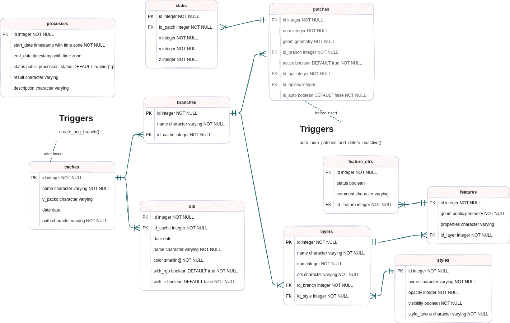

# PackO

Outil pour le contrôle et la retouche du mosaïquage, sous licence CECILL-B (voir [LICENSE.md](LICENSE.md)).

4 modules :
- une BD Postgis
- une API
- un client web
- un code python pour la création et mise à jour du cache

## BD

Une base de données est utilisée pour stocker les métadonnées des caches (liste des OPI avec leur date, nom, couleur, ...) ainsi que l'historique sur chaque branche (liste des patches).

La structure de cette base:


Il est nécessaire d'avoir un PostGIS version 3.0 au minimum (pour l'utilisation de la fonctionnalité "ST_AsGeoJSON(row) generates full GeoJSON Features"). 

La base de donnée doit être créée avant le lancement de l'API:
```
psql -c "CREATE DATABASE packo"
psql -d packo -f sql/packo.sql
```

## API

### Pour installer et lancer le service

La commande classique avec NodeJs:
```shell
npm install
```

Préparer le client web:
- en mode production
```shell
npm run build
```
- en mode développement (avec le menu "clear")
```shell
npm run build-dev
``` 

Ensuite on peut lancer l'API, la doc et l'interface web
- en mode production
```shell
npm start
```
- en mode développement (qui autorise la route "clear")
```shell
npm start-dev
```

L'interface web est alors accesible à l'adresse : http://[serveur]:[port]/itowns

par defaut serveur= localhost et port = 8081

La doc de l'API est publiée directement par le service et est disponible à l'adresse : http://[serveur]:[port]/doc

### Principe de fonctionnement

Ce service propose: 

- un flux WMTS standard pour les couches ortho et graph
- un flux WMTS permettant d'accéder aux OPI: ce flux est déclaré comme une couche unique (opi) et on utilise un paramètre de dimension pour choisir le cliché à afficher. Attention, il faut normalement déclarer explicitement toutes les valeurs de dimension dans le GetCapabilties: cela ne va pas être possible de déclarer toutes les clichés. Il va falloir trouver une astuce... 
- une commande permettant de modifier le graphe en donnant: un geojson + une référence de cliché

## Client web (uniquement si on souhaite le lancer séparément)

### Installation et lancement

dans le dossier ./itowns
```shell
npm install
```

En phase de développement on lance le service avec :

```shell
npm start
```
qui permettra un redémarrage du serveur automatique à chaque modification de fichier

En production il faut exécuter :
```shell
npm run build
```

### Principe de fonctionnement

Fournir à travers un navigateur web :
- une consultation des données ortho
- des outils de retouche du graph de mosaiquage

## Préparation d'un cache

Un cache PackO se crée à partir d'un graphe de mosaiquage initial (sous forme d'un GeoPackage ou d'une BD) ainsi qu'un dossier contenant les OPI dans un format supporté par GDAL avec leur géoréférencement.

Pour les gros caches, il est préférable de créer une BD à partir du fichier Shapefile, cela peut être fait avec la commande **shp2pgsql**, par exemple:
```bash
createdb pcrs
psql -d pcrs -c 'create extension postgis'
shp2pgsql /Volumes/PAOT\ 21/ZoneTestPCRS/Graphe/Graphe_PCRS56_ZONE_TEST.shp | psql -d pcrs
psql -d pcrs -c "SELECT UpdateGeometrySRID('graphe_pcrs56_zone_test','geom',2154)"
```

Pour le moment, PackO ne gère que des images 3 canaux (RGB), mais des évolutions sont en cours pour gérer des images 4 canaux (RGB+IR).

La création du cache est faite à l'aide d'un script python:
````
python scripts/create_cache.py -i "regress/data/*.tif" -o ressources/LAMB93_5cm.json -c cache_regress -g "regress/data/regress_graphe.gpkg" -t graphe
````

Ce script nécessite deux modules: numpy et gdal (version au moins 3.2). Par exemple, sous Linux, on peut les installer avec les commandes:
````
python -m pip install --upgrade pip
pip install numpy
pip install --global-option=build_ext --global-option="-I/usr/include/gdal" GDAL==`gdal-config --version`
````

Les paramètres de ce script sont:
````
usage: create_cache.py [-h] -i INPUT [-c CACHE] [-o OVERVIEWS] [-g GEOPACKAGE] [-t TABLE] [-p PROCESSORS] [-v VERBOSE]

optional arguments:
  -h, --help            show this help message and exit
  -i INPUT, --input INPUT
                        input OPI pattern
  -c CACHE, --cache CACHE
                        cache directory (default: cache)
  -o OVERVIEWS, --overviews OVERVIEWS
                        params for the mosaic (default: ressources/LAMB93_5cm.json)
  -g GEOPACKAGE, --geopackage GEOPACKAGE
                        in case the graph base is a GeoPackage and not a postgres base define through env variables
  -t TABLE, --table TABLE
                        graph table (default: graphe_pcrs56_zone_test)
  -p PROCESSORS, --processors PROCESSORS
                        number of processing units to allocate (default: Max_cpu-1)
  -v VERBOSE, --verbose VERBOSE
                        verbose (default: 0)
````

Ce script fonctionne en deux phases:

- on découpe les OPI en dalle respectant une pyramide TMS que l'on stocke sous forme de COG
- on rasterise le graphe de mosaiquage et on export pour chaque dalle un COG de graphe (image de graphe avec une couleur par OPI) et un COG de l'ortho assemblée

Le script permet d'obtenir une arboresence de COG et un fichier overviews.json qui décrit la liste des dalles et la liste des OPI avec les métadonnées associées. 

Une fois le cache créé, on peut y ajouter des OPI si nécessaire avec le script update_cache.py:
````
python scripts/update_cache.py -i "regress/data/update/*.tif" -c cache_regress -g "regress/data/regress_graphe.gpkg" -t graphe
````

Pour importer un cache dans la BD packo, il faut utiliser la route POST **cache** de l'API: http://localhost:8081/doc/#/cache/post_cache.

Cette route prend en paramètre:

- le nom du cache (il doit être unique dans la base)
- le chemin du dossier contenant les COG (ex: "cache_test"): soit en absolu, soit en relatif par rapport au dossier de lancement de l'API
- le contenu du fichier overviews.json (celui qui a été créé par le script python)


[](https://www.ign.fr)